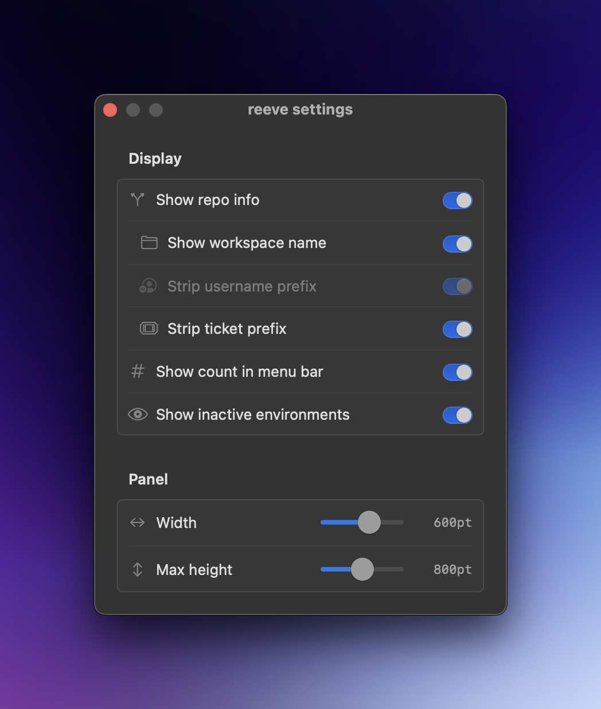

# reeve

Keep an eye on your [PM2](https://pm2.keymetrics.io/) processes from the macOS menu bar — live status, CPU, memory, logs, and one-click restart/stop, without keeping a terminal open.


## Why reeve?

`pm2 monit` and `pm2 logs` live in a terminal tab you have to keep open and remember to check. reeve puts the same information one click away in your menu bar: a glanceable health indicator that's always there, plus the controls to restart, stop, or inspect logs for a process without switching context. It discovers every PM2 workspace on your machine automatically and groups processes by environment, so juggling multiple projects stays manageable.

## Features

- 📊 **Monitor processes** — view real-time status, CPU, memory, uptime, and ports for all PM2 processes with sparkline graphs
- 🎛️ **Manage processes** — restart, stop, or delete individual processes directly from the menu bar
- 🗂️ **Multiple environments** — automatically discovers all PM2 workspaces (`~/.pm2`, `~/.pm2-*`)
- 🔁 **Crash-loop detection** — flags processes that are rapidly restarting and provides debug info
- 🛟 **Daemon error recovery** — surfaces PM2 daemon errors inline with a one-click kill to clear stuck or duplicate daemons
- 🪵 **Live log streaming** — view process logs in real-time with ANSI color stripping
- 🔔 **Desktop notifications** — get alerted when processes crash or restart
- 🔀 **Git repo & branch info** — shows the git repo name and branch for each environment, with configurable prefix/ticket stripping
- 🔍 **Filter** — search processes by name, repo, or branch (⌘K to focus)
- ⚙️ **Settings window** — native macOS settings panel for all display and layout options (⌘,)
- 🚀 **Launch at login** — toggle via the menu bar dropdown

## Install

The recommended way to install reeve is via [Homebrew](https://brew.sh):

```bash
brew install --cask fredrivett/tap/reeve
```

This handles everything for you, including clearing the quarantine flag so the app opens without any Gatekeeper warnings.

### Installing the DMG directly

reeve is **not yet code-signed or notarized** (that needs a paid Apple Developer account, which is a potential follow-up). The Homebrew cask handles this automatically, so it's the smoothest path. If you download the `.dmg` from the [releases page](https://github.com/fredrivett/reeve/releases) instead, macOS Gatekeeper will warn that the app is from an unidentified developer. To open it:

1. Drag **reeve** to your Applications folder.
2. Right-click (or Control-click) **reeve.app** and choose **Open**, then confirm in the dialog. You only need to do this once.

If macOS still refuses to open it, clear the quarantine flag manually:

```bash
xattr -c /Applications/reeve.app
```

## Requirements

- macOS 13+
- [PM2](https://pm2.keymetrics.io/) installed globally (`npm install -g pm2`)

## Development

```bash
# Build and run (recommended — creates a proper .app bundle for the menu bar)
./run.sh

# Test
swift test
```

> **Note:** `swift run reeve` builds a bare binary without an `.app` bundle, which prevents the menu bar icon from appearing on macOS. Use `./run.sh` instead, which wraps the binary in a minimal `.app` bundle so macOS can register the status item.

The app runs as a menu bar accessory (no Dock icon). It polls PM2 for process status every 3 seconds by default.

## Configuration

Most options can be changed from the native settings window (⌘,):



Config is also stored at `~/.config/reeve/config.json`:

- `pollIntervalSeconds` — refresh interval for process status (default: `3.0`)
- `collapsedEnvironments` — which environment groups are collapsed in the UI
- `showRepoName` — show git repo and branch info per environment (default: `true`)
- `showWorkspaceName` — show workspace name badge alongside repo info (default: `true`)
- `stripBranchPrefix` — strip username prefix from branch names (default: `true`)
- `stripTicketPrefix` — strip ticket prefix (e.g. `ENG-123-`) from branch names (default: `true`)
- `showMenuBarCount` — show process count in the menu bar icon (default: `true`)
- `showInactive` — show inactive environments section (default: `true`)
- `panelWidth` — panel width in points (default: `600`, range: 440–700)
- `panelMaxHeight` — max panel height in points (default: `800`, range: 400–1200)

## Project structure

```
Sources/
├── ReeveApp/          # App entry point, menu bar setup
└── Reeve/             # Main library
    ├── Models/        # PM2Process, PM2Environment, AppConfig
    ├── Services/      # PM2Service, EnvironmentScanner, ConfigService, NotificationService
    └── Views/         # SwiftUI views (ContentView, ProcessRowView, LogPanelView, etc.)
Tests/
└── reeveTests/        # Test suite
```

## License

reeve is released under the [MIT License](LICENSE).
